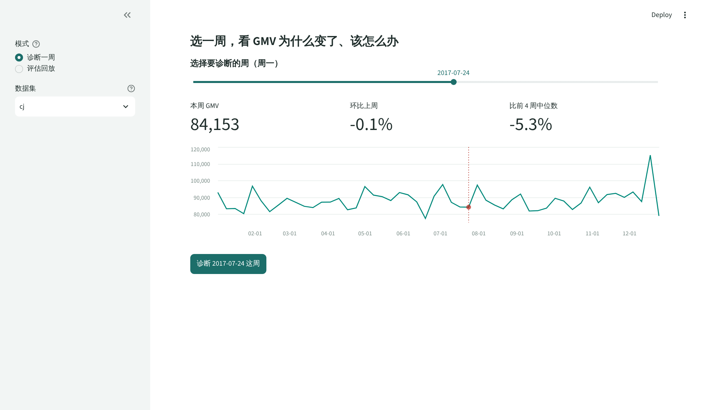
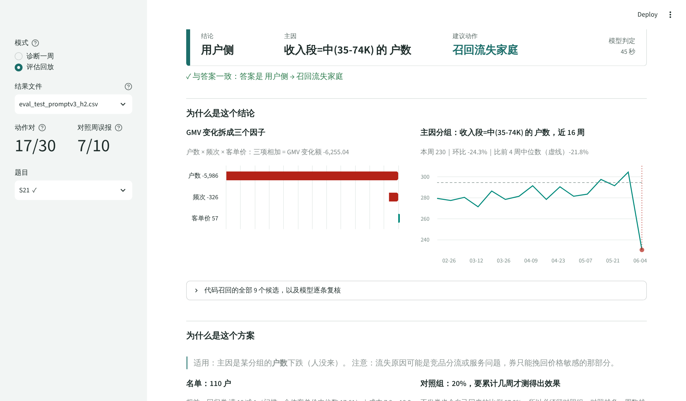
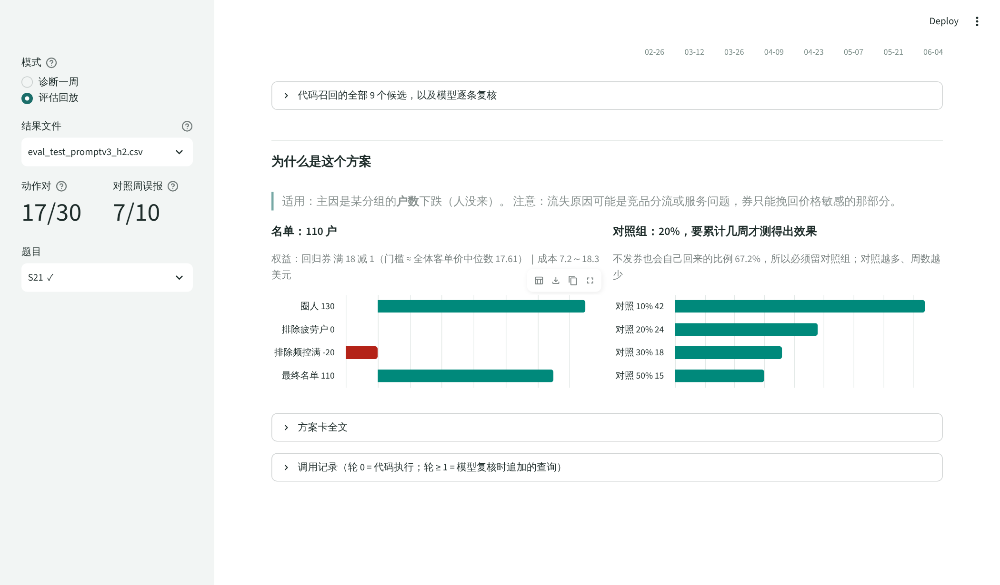
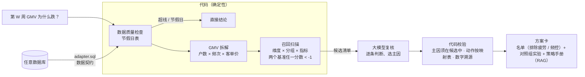

# 指标异动诊断 Agent：从"为什么跌"到"该对谁做什么"

运营问"第 W 周 GMV 为什么跌了、该怎么办"，Agent 给出**主因 + 建议动作 + 可执行的方案卡**（名单、权益、成本、对照组实验），每个数字都能追溯到代码计算结果；诊断和方案两层都有标准答案和评估。

**测试集动作准确率 57%（规则基线 50%）· 方案名单与独立 SQL 一致率 1.000 · 方案数字 100% 可溯源 · 修复分组"未来函数"（影响 26/51 周召回）**

<!-- 演示视频：录好后把链接放在这里，例如 [▶ 2 分钟演示视频](https://...) -->



## 它解决什么问题

用户运营在周会上看到 GMV 下跌后，现状要 3～5 天才能从结论走到发券，而且发完券说不清有没有用；用上诊断助手后，周会前就能拿到结论、依据和可执行的名单，是否执行仍由人决定。


## 它能做什么

| 结论 | 判断依据 | 输出 |
|---|---|---|
| 正常波动 | 节假日表内，或没有任何分组超出自身历史 90 分位 | 不行动 + 证据 |
| 数据问题 | 无效行占比突增 / 门店整片无数据 / 连续 2 天断崖 | 修数据 + 超线项 |
| 用户侧 | 某类用户的户数 / 频次 / 客单价异常 | 召回 / 提升频次 / 提升客单价 / 补券 → 人群包 + 对照组实验 |
| 商品侧 | 某品类或细分品类 GMV 异常 | 排查商品 → 问题商品清单 |

每个结论都附两段数据依据：**为什么是这个结论**（GMV 拆成户数 × 频次 × 客单价、主因分组近 16 周趋势、全部候选与复核理由）和**为什么是这个方案**（策略手册的适用条件、名单怎么圈出来的、对照组比例与所需周数）。

| 结论依据 | 方案依据 |
|---|---|
|  |  |

### 诊断后继续追问（Text-to-SQL）

诊断结果下方可以用一句话继续问数，例如“这周主因分组里有多少户买了 MEAT”，页面返回结果表、一句话解读和模型写的 SQL：

- **口径来自语义层**：指标口径和维度说明由 `metrics.yaml` 自动生成进 prompt；“这周”“主因分组”由代码替换成本次诊断的周和分组
- **安全靠代码**：只读连接 + 只放行单条 SELECT + 自动 LIMIT 200；SQL 报错时把报错原文发回模型重写，最多 2 次
- **算不出就拒答**：语义层里没有 SQL 口径的指标（周留存率、流失家庭数）和数据里没有的内容（如 App 日活）

评估：10 道题（简单 3 / 中等 4 / 难 2 / 应拒答 1），模型 SQL 与标准答案 SQL 的**执行结果一致**才算对，**执行准确率 10/10**（`code\project\ask_eval.py`，结果见 `data\ask_eval_v1.csv`）。这些题都写得比较明确；正式运行前用一条题外问题做冒烟测试（“这周腰部门店卖了多少单”），模型把“腰部门店”理解成“主力门店为腰部的用户”（1,980 单，正确为 1,960 单），说明含糊问法尚未覆盖。

## 架构：能确定的交给代码，模型只做复核



**演进**（数据见[评估报告](docs/评估报告.md)）：

| 版本 | 做法 | 开发集动作对 |
|---|---|---|
| v2 | 自主 Agent：模型自己决定查什么 | 5/22（规则基线 13/22；数据问题和商品侧容易漏查） |
| v3 | **代码召回 + 模型复核** | 16/22（两次运行一致） |
| v4 | 动作由代码按映射表决定；数据质量改看全平台 | 开发集不变，测试集 +2 题（预注册口径） |

主线是**把能确定的判断不断从模型手里收回给代码**：模型负责在候选之间做权衡和写解释，名单、成本、样本量、动作映射全部由代码计算。

## 评估

在真实交易数据上**人为埋入已知原因的异常**（删掉某类用户的订单、某品类缺货、数据断流），生成标准答案；系统冻结后再生成测试集，**测试集只跑一次**（代码强制）。

**测试集正式成绩（30 题 = 20 个异常 + 10 个没埋异常的对照周）**

| 指标 | 本系统 v3 | 规则基线（不用大模型） | 验收线 |
|---|---|---|---|
| 动作类型准确率 | **17/30 = 57%** | 15/30 = 50% | ≥ 80%（未达标） |
| 对照周误报 | **7/10** | 9/10 | ≤ 2/10（未达标） |
| 主因 Top-1 | **63%** | 53% | ≥ 基线 ✅ |
| 人群包一致率（与独立 SQL 重算的 Jaccard） | **1.000** | — | ≥ 0.9 ✅ |
| 方案违反规则 | **0 条** | — | 0 ✅ |
| 数字溯源 | **180/180** | — | ≥ 99% ✅ |
| 稳定性（10 题 × 3 次主因一致） | **8/10** | — | ≥ 90%（未达标） |

**结论**：方案层的 3 项指标全部达标，名单、规则、数字都能独立验证；主因定位也高于规则基线。诊断层的动作准确率、对照周误报和稳定性尚未达到验收线，三者来自同一个原因：数据是 2,469 户的抽样，每个分组只有一两百户，组内的自然波动和 5% 的小幅异常在数据上较难区分。在真实平台的样本规模下，这个问题预计会缓解，但尚未验证。

开发集到测试集的下降（73% → 57%）中，约 12pp 来自对开发集的过拟合，这也是测试集必须在冻结后只跑一次的原因。开发集上"模型复核优于代码规则"的优势，在测试集上暂未体现；下一步计划用自一致性（同一题多跑几次，结论不一致就判为正常波动）来降低误报。13 道错题的逐题归因见[评估报告第 4 节](docs/评估报告.md)。

## 接入其他数据库

项目只认 6 张标准表（数据契约）。接新库只需在 `datasets\<名字>\` 下写两个文件：

- `adapter.sql`：把源库的表翻译成标准表（列名映射，约 15 行）
- `metrics.yaml`：时间范围、节假日、维度规则、数据质量阈值

然后运行 `python code\project\connect.py <名字>`，它会检查缺表 / 缺列 / 类型 / 粒度 / 订单一致性 / 历史长度，通过后建视图。`datasets\cj_ecom\` 把同一份数据改成国内电商表结构（orders / order_item / sku …）接入，**51 周召回结果与原库逐项一致**。这只证明"能接"，不代表在新业务数据上同样准确。

### 新一周的数据进来怎么办

- `metrics.yaml` 里写 `valid_to: auto`：重跑 `connect.py` 时自动识别最后一个 7 天都齐的周，新的一周直接出现在页面上
- **分组不偷看未来**：诊断某一周时，门店分组和用户的主力门店只用这一周**之前**的数据计算。原来按全年计算时，分析 6 月时有 8.5% 的家庭被分进了"用全年数据才知道"的组；换成滚动分组后，51 周里有 26 周的召回候选随之改变
- `datasets\cj_live\` + `simulate_week.py` 模拟数据逐周到达：源库先只有截至 11-27 的订单，"到达" 12-04 这一周后重跑接入，新周可以直接诊断，**旧周再诊断结果不变**

```powershell
python code\project\simulate_week.py init 2017-11-27
python code\project\connect.py cj_live
python code\project\simulate_week.py add      # 下一周到达
python code\project\connect.py cj_live
```

## 运行

Windows + Python 3.12。

```powershell
python -m venv .venv
.\.venv\Scripts\Activate.ps1
python -m pip install openai python-dotenv pandas pyreadr duckdb requests pyyaml streamlit

python code\project\data_prep.py      # 下载数据（约 15 MB）→ data\cj.duckdb
python code\project\semantic.py       # 建 fact 视图
python code\project\inject.py         # 开发集：埋异常（评估回放要用）
python code\project\inject.py test    # 测试集
streamlit run code\project\app.py     # 演示页
```

- **只看评估回放**：不需要任何 key
- **诊断一周**：在 `.env` 里写 `OPENROUTER_API_KEY=...`（模型 `deepseek/deepseek-chat`，经 OpenRouter）；方案卡还需要本地 [Ollama](https://ollama.com) 的 `bge-m3` 向量模型
- 复现评估：见[评估报告第 8 节](docs/评估报告.md)

| 目录 | 内容 |
|---|---|
| `code\project\` | 全部代码；`archive_v2\` 是自主 Agent 版本存档；`m2_* / m3_* / peek.py` 是数据探查脚本 |
| `docs\` | 评估报告、口径文档、策略手册、开发集 / 测试集场景表 |
| `datasets\` | 接入其他数据库的配置 |
| `data\` | 评估结果、调用记录（trace）、方案卡、人群包、冻结指纹（数据库不上传，用 data_prep.py 生成） |

## 局限

1. 异常是人为埋入的，每个场景只有单一原因；测试集只有 30 题，单次运行约 ±2 题（±7pp）波动
2. 只有一个数据集（美国连锁超市，2017 年，2,469 户抽样），无同比
3. 没有真实用户试用；无法真实发券，方案的效果只能用历史活动核销率粗估，不是因果效果
4. 名单只有一两百到五百户，对照组实验要累计 6～24 周才测得出效果；真实平台规模下会显著缩短
5. v4 的修复由测试集错题发现，缺少新的留出集验证
6. 离线评估使用全年分组（埋异常时按全年分组选人，测试集不能重跑）；上线诊断使用滚动分组，两者结果会有差异
7. `approve.py`（审批清单）在 v1.8 移出范围，文件保留未使用
8. 自由追问的测试集只有 10 题（题目由 AI 起草、作者审核），单次运行；追问查询的是全年分组的 fact 视图，与诊断使用的滚动分组可能有差异

完整列表见[评估报告第 7 节](docs/评估报告.md)。

## 数据与参考

- 数据：84.51° *The Complete Journey*，经 R 包 [completejourney](https://github.com/bradleyboehmke/completejourney) 获取（CC0）。业务故事按国内即时零售改写，数据本身为美国连锁超市
- 参考：[kpi-rca-agent](https://github.com/nivi9944/kpi-rca-agent)（异常注入 + 标准答案、对照周、规则基线、冻结后建测试集的评估思路）；[Data-Analysis-Agent](https://github.com/Zafer-Liu/Data-Analysis-Agent)（全链路分析产品，无评估体系，本项目未使用其代码）；dbt MetricFlow / Cube（语义层）
- 代码：MIT License
