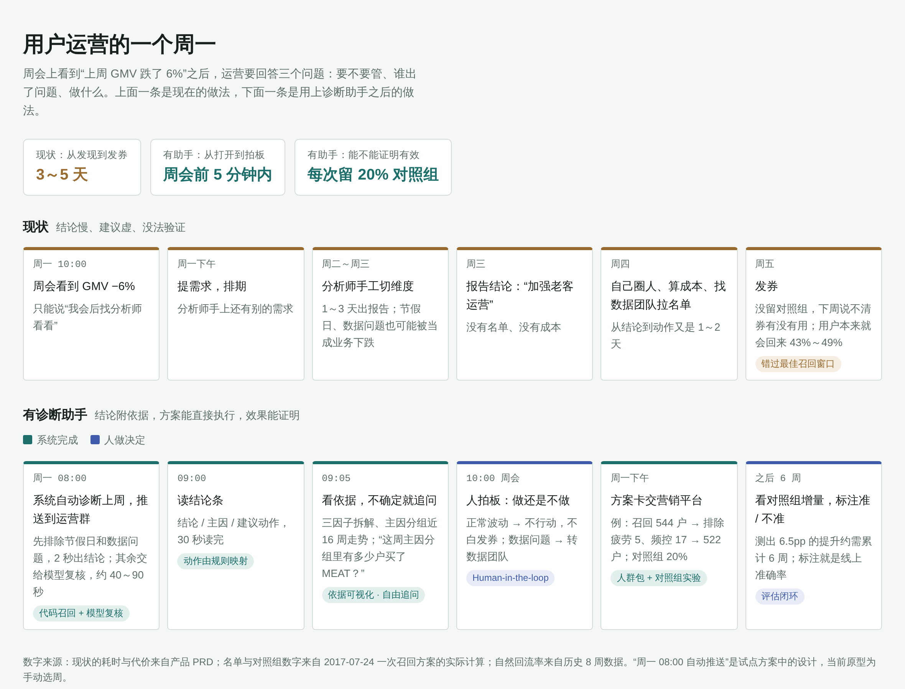

# PRD：指标异动诊断助手

| 项 | 内容 |
|---|---|
| 版本 | v1.0 · 2026-10-09 |
| 阶段 | 原型完成，离线评估完成；**待试点** |
| 一句话 | 周 GMV 异动时，5 分钟内给运营一份"有依据、可执行、可验证"的方案，而不是一份等 3 天的分析报告 |
| 相关文档 | [评估报告](评估报告.md) · [口径文档](口径文档.md) · [策略手册](策略手册.md) |

---

## 1. 为什么做

### 1.1 问题

周会上发现"上周 GMV 跌了 6%"之后，用户运营要回答三个问题：**要不要管？谁出了问题？做什么？** 今天这三个问题的答案来得太慢、太虚：

| 现状 | 代价 |
|---|---|
| 提需求给分析师，排期 + 手工切维度，**1～3 天**才有结论 | 错过最佳干预窗口：本周没来的用户，越晚召回越难 |
| 分析报告的建议停在"加强老客运营" | 运营还要自己圈人、算成本、找数据团队拉名单，**从结论到动作又是 1～2 天** |
| 很多"下跌"其实是节假日、月初回落或数据问题 | 浪费分析资源；数据问题被当成业务问题，甚至白白发券 |
| 市面上的 AI 分析工具能自动写"洞察" | **没有人知道它说得对不对**：没有评估，业务不敢据此花钱 |

### 1.2 机会

异动诊断的大部分步骤是**确定的**（排除数据问题、拆解、下钻、按规则映射动作、按规则圈人），只有"多个可疑原因里哪个是主因"需要判断。把确定的部分交给代码，判断部分交给大模型复核，再用评估把关，就能同时做到**快**和**可信**。

### 1.3 为什么是现在

大模型已经能稳定地做"在给定证据里做取舍、写解释"；而公司内部的指标口径、营销活动、核销数据都已在数仓里，具备接入条件。

---

## 2. 给谁用

| 用户 | 要完成的任务 | 今天的痛点 | 这个产品给他什么 |
|---|---|---|---|
| **用户运营（核心用户）** | 周会后决定这周要不要做召回 / 促活 | 等分析、等名单 | 选一周 → 结论 + 名单 + 对照组方案 |
| 运营负责人 | 判断"这次下跌值不值得投入" | 凭经验 | 明确区分"正常波动 / 需要行动 / 数据问题"，并给出依据 |
| 数据分析师 | 少接重复的"为什么跌"需求 | 被动排期 | 常规异动自助解决，只处理系统标记为不确定的周 |
| 数据团队 | 尽早发现数据断流 | 业务方先发现，再倒查 | 数据问题自动识别，并列出超线项 |

**核心用户故事**：作为用户运营，我在周一周会前选中上周，**5 分钟内**拿到"主因是谁、该做什么、发给哪些人、花多少钱、怎么证明有效"，并且能看到每个结论背后的数据，这样我可以直接在周会上拍板，而不是"我会后找分析师看看"。



---

## 3. 目标与衡量

### 3.1 北极星指标

**有效干预周占比** = 被诊断为"需要行动"且方案被执行、实验证明有正向增量的周 ÷ 被诊断为"需要行动"的周。

它同时约束了三件事：诊断要准（否则实验无增量）、方案要能执行（否则不被采纳）、要留对照组（否则无法证明）。原型阶段无法测量，**试点阶段开始追踪**。

### 3.2 指标体系

| 类型 | 指标 | 目标 | 原型实测（离线测试集） |
|---|---|---|---|
| 效率 | 选周 → 拿到完整方案的时间 | ≤ 5 分钟 | 约 40～90 秒；代码直接判定的约 2 秒 ✅ |
| 准确 | 动作类型准确率 | ≥ 80% | 57%（规则基线 50%） |
| 准确 | 主因定位命中率 | ≥ 规则基线 | 63% vs 53% ✅ |
| 可执行 | 名单与独立 SQL 重算一致 | ≥ 0.9 | 1.000 ✅ |
| 护栏 | 没事的周被误报为"需要行动" | ≤ 20% | 70% |
| 护栏 | 方案违反业务规则（疲劳用户、频控、成本上限） | 0 | 0 ✅ |
| 护栏 | 方案里的数字均可溯源 | ≥ 99% | 100%（180/180）✅ |
| 护栏 | 同一周重复诊断结论一致 | ≥ 90% | 80% |

### 3.3 现状判断

**方案层已具备试点条件，诊断层还不能独立做决定。** 误报率 70% 意味着：如果直接让系统决定发券，10 个没事的周会白发 7 次。因此试点阶段的定位是**"运营的诊断助手"而非"自动决策"**：系统给结论和依据，人做最终判断（见第 7 节）。

误报的主要原因已经定位：原型数据为 2,469 户抽样，每个分组只有一两百户，自然波动与 5% 的小幅异常难以区分。真实平台样本量大得多，预计会改善，**这是试点要验证的第一个假设**。

---

## 4. 做什么、不做什么

### 4.1 范围

| 优先级 | 能力 | 验收标准 |
|---|---|---|
| **P0** | 选周诊断，给出四类结论之一：正常波动 / 数据问题 / 用户侧 / 商品侧 | 任意一个完整周都能出结论，不报错 |
| **P0** | 先排除"不该管"的周：节假日、数据质量超线 | 节假日周、数据断流周不进入模型判断，2 秒内出结论 |
| **P0** | 找主因：GMV 拆成户数 × 频次 × 客单价，全量扫描各分组，模型在候选中选主因 | 主因必须来自代码召回的候选；证据数字可溯源 |
| **P0** | 动作由规则决定，不由模型决定 | 同一主因永远映射到同一动作 |
| **P0** | 可执行方案：名单、权益、成本、对照组比例、所需周数 | 名单排除疲劳用户和频控已满用户；成本不超上限 |
| **P1** | 依据可视化：为什么是这个结论、为什么是这个方案 | 每个结论至少附 1 张趋势图和 1 张拆解图 |
| **P1** | 新一周数据自动纳入，分组不使用诊断周之后的数据 | 新数据到达后，旧周再诊断结论不变 |
| **P1** | 接入其他数据库 | 写一份字段映射 + 一份口径配置即可接入；接入前自动校验 |
| **P1** | 评估回放 | 可查看每道测试题的结论、错因 |
| P2 | 分品类 / 分人群提问（如"MEAT 品类为什么跌"） | 后端已支持，页面未开放 |

### 4.2 明确不做（及原因）

| 不做 | 原因 |
|---|---|
| 自动发现异动 | 周会本身就是发现机制；先把"发现之后"做准，再考虑前移 |
| 审批与投放 | 属于营销平台的职责；方案卡输出"需人工确认后执行"，由现有流程接手 |
| 让模型自主决定查什么 | 原型验证过：自主模式动作准确率 5/22，低于不用模型的规则基线 13/22（漏查数据问题、漏查商品） |
| 估算方案的因果增量 | 用券用户中 43%～49% 本来就会自然回来；只给"用券用户 GMV"区间，明确标注不是增量，增量由对照组实验回答 |

---

## 5. 关键决策记录

| 决策 | 备选 | 选择及理由 |
|---|---|---|
| 谁来判断 | 模型自主 / 代码规则 / **代码召回 + 模型复核** | 确定的事交给代码（不漏、可复现），模糊的取舍交给模型；模型只能在候选里选 |
| 动作由谁定 | 模型写 / **代码映射** | 原型中模型多次写错映射；映射是业务规则，不需要"智能" |
| 方案里的执行信息 | 模型写 / **代码生成** | 第一版由模型自由撰写，两张方案卡都漏了对照组 |
| 召回名单的定义 | 连续 2 周没来 / **前 28 天买过、本周没来** | 窄定义只圈到 18/72 的刚流失用户；宽定义的浪费由对照组量化 |
| 分组口径 | 全年 / **截至诊断周之前** | 全年口径是"未来函数"：分析 6 月时有 8.5% 的用户被分进了用全年数据才知道的组 |
| 评估方式 | 人工抽查 / **埋入已知异常 + 冻结后只跑一次的测试集** | 线上没有标准答案；只有离线埋异常才能算准确率，冻结防止"看着答案调参数" |

---

## 6. 用户体验

### 6.1 主流程

```
选数据集 → 拖动滑块选周
   页面同时显示：全年 GMV 走势（选中周标红）、本周 GMV、环比、比前 4 周中位数
→ 点"诊断这一周"
→ 结论条：结论 / 主因 / 建议动作 / 判定方式 / 用时
→ 为什么是这个结论：三因子拆解、主因分组近 16 周趋势、全部候选及复核理由
→ 为什么是这个方案：策略手册条款、名单怎么圈出来的、对照组比例与所需周数、方案卡全文
```

**设计原则**：先给结论，再给依据；依据默认展开最关键的两张图，其余折叠。运营在周会上 30 秒能讲清楚，分析师追问时 3 次点击内能查到底层数字。

### 6.2 边界情况

| 情况 | 产品表现 |
|---|---|
| 节假日周 | 直接给"正常波动"并说明是哪个节日，不调用模型 |
| 数据质量超线 | 直接给"数据问题"，列出超线项，提示交给数据团队 |
| 扫描后没有任何可疑分组 | 直接给"正常波动" |
| 模型选的主因不在候选中，或数字无法溯源 | 自动退回重写 1 次；仍不通过则展示结果并标记"校验未通过"，提示人工复核 |
| 模型写错动作 | 按映射表自动纠正，并保留模型原写以便追查 |
| 模型服务限流或超时 | 自动重试；最终失败时提示稍后再试，不出半成品 |
| 未开通模型服务 | 诊断按钮置灰并说明原因，仍可查看评估回放 |
| 方案依赖的检索服务不可用 | 只出诊断结论和依据，不出方案卡，并说明原因 |
| 新接入的数据库不合格 | 拒绝接入并逐条列出原因（缺表、缺字段、粒度错误、历史不足 5 周）；缺画像表或营销表时，自动关闭对应功能而不是报错 |
| 年初历史太短 | 分组不稳定；建议前几周只看数据质量和整体拆解（待试点确认阈值） |

---

## 7. 上线计划

### 7.1 试点设计

| 项 | 方案 |
|---|---|
| 范围 | 1 个业务线的用户运营团队，**4～6 周** |
| 用法 | 每周一系统自动诊断上一周，推送到运营群；运营在周会上参考，**是否执行由人决定** |
| 对照 | 每次执行的方案保留对照组（默认 20%，哈希固定、跨周不换组） |
| 要验证的假设 | ① 真实样本量下误报率能降到 20% 以内 ② 运营愿意采纳（采纳率 ≥ 50%）③ 被执行的方案有正向增量 |
| 收集的反馈 | 每次诊断后运营标注"准 / 不准 / 不确定"，作为线上准确率 |

### 7.2 试点成功标准（进入推广的门槛）

| 指标 | 门槛 |
|---|---|
| 线上误报率（运营标注"不准"的需要行动周） | ≤ 20% |
| 方案采纳率 | ≥ 50% |
| 被执行方案中实验显示正向增量的比例 | ≥ 50% |
| 诊断耗时 | 稳定 ≤ 5 分钟 |

**不达标时**：误报高 → 先上线"自一致性"（同一周诊断 3 次，结论不一致判正常波动）；采纳低 → 访谈运营，看是结论不可信还是方案不可执行。

### 7.3 生产环境需要补齐的能力

| 环节 | 生产做法 | 原型现状 |
|---|---|---|
| 数据同步 | 业务库每天同步到数仓，按天分区 | 整库重建 |
| 分组快照 | 用户分组、门店分组按天存快照 | 诊断时按诊断周临时计算 |
| 就绪检查 | 调度任务等上周数据落地；行数突降、字段为空则告警，不出诊断 | 接入时检查一次 |
| 规模 | 亿级明细先预聚合为"周 × 分组"汇总表 | 直接扫明细（147 万行） |
| 执行闭环 | 运营确认后名单进入营销平台；实验平台分流并回收增量 | 只到方案卡 |
| 安全与成本 | 只读账号；交给模型的只有聚合数字，不含用户明细；设模型费用上限，失败时降级为只出代码召回结果 | 只读连接；模型只看候选清单 |
| 本地化 | 节假日表换成春节、618、双 11 等，由运营维护 | 美国节假日 |

---

## 8. 风险与应对

| 风险 | 可能性 | 影响 | 应对 |
|---|---|---|---|
| 误报导致白发券 | 高（原型 70%） | 浪费预算、运营失去信任 | 试点期只做助手不做决策；自一致性降误报；所有方案必留对照组 |
| 运营只看结论不看依据 | 中 | 错误结论被直接执行 | 结论条下方默认展开依据；"校验未通过"显著提示 |
| 模型解读错数字（数字对、意思错） | 中（原型已出现 1 例） | 方案理由误导 | 确定性检查（如"活动刚结束则先补券"）改由代码执行 |
| 大促期间波动远超平时 | 高 | 大促后集中误报 | 大促周进节假日表；大促后单独设阈值 |
| 数据口径与看板不一致 | 中 | 业务不信任 | 口径统一走指标平台；页面显示每个指标的口径说明 |

---

## 9. 待决问题

| 问题 | 需要谁决定 | 截止 |
|---|---|---|
| 试点选哪个业务线（样本量大、周会节奏固定的优先） | 运营负责人 | 试点前 |
| 单次方案的成本上限、单用户每月触达上限 | 用户运营 + 财务 | 试点前 |
| 线上"准 / 不准"由谁标注、多久标注 | 运营负责人 | 试点第 1 周 |
| 年初历史不足时的处理阈值 | 产品 + 数据分析 | 试点第 2 周 |

---

## 附录：原型数据说明

- 数据：84.51° *The Complete Journey*（美国连锁超市 2,469 户、2017 年、147 万行交易、27 个营销活动、2,102 次核销，CC0）；业务故事按国内即时零售改写
- 关键事实：周 GMV 环比中位数 5.2%、90 分位 15.6%；画像覆盖 32% 的家庭；本周没来的用户下周自然回来 43%～49%
- 评估：埋入 20 个已知原因的异常 + 10 个没埋异常的对照周；系统冻结后只跑一次。详见[评估报告](评估报告.md)
